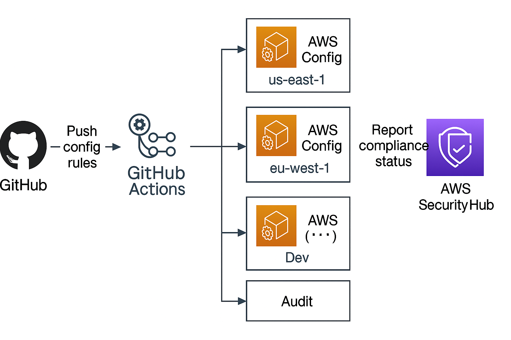

# 🔐 Compliance-as-Code: Multi-Account AWS Config Rule Deployment (GRC Engineering Lab)


---

## 1. 🧠 Overview

**Scenario**: You're a GRC engineer managing 100+ AWS accounts across multiple regions. Your mission? Enforce compliance with CIS, NIST 800-53, and ISO 27001 — not manually, but through scalable, automated AWS Config rules delivered as code.

This repo demonstrates how to:
- Transform written security controls into auditable AWS Config rules
- Deploy rules using GitHub Actions + CloudFormation
- Automate compliance enforcement across environments with traceability and version control

---

## 2. 🧩 Architecture Diagram



---

## 3. 🎯 Lab Objectives

- ✅ Define a managed AWS Config rule (IAM_PASSWORD_POLICY)
- ✅ Convert it into JSON format with tagging metadata
- ✅ Write a CloudFormation template for reusable deployments
- ✅ Configure GitHub Actions to validate + deploy rules on push
- ✅ Store AWS credentials securely using GitHub Secrets

---

## 4. 🗂️ Project Structure

```bash
.
├── config-rules/
│   └── cis-1-4-1-iam-password-policy.json
├── templates/
│   └── config-rule-template.yaml
├── .github/
│   └── workflows/
│       └── config-rule-deploy.yml
├── architecture.png
└── README.md
---

## 5. ⚙️ How It Works

- All AWS Config rules are defined as `.json` files inside `config-rules/`
- Rules are deployed via `templates/config-rule-template.yaml`
- On every Git push to `config-rules/` or `templates/`, GitHub Actions:
  - Validates syntax
  - Loads AWS credentials from `Secrets`
  - Runs `aws cloudformation deploy` to apply the rule

---

## 6. 🚀 CI/CD Pipeline (GitHub Actions)

| Stage                       | Description                                           |
|-----------------------------|-------------------------------------------------------|
| `Checkout`                  | Fetches code from GitHub repo                        |
| `Configure AWS Credentials` | Loads from `AWS_ACCESS_KEY_ID` and `AWS_SECRET_ACCESS_KEY` |
| `CloudFormation Deploy`     | Applies the latest Config rule via CLI               |

---

## 7. 🧠 Skills Demonstrated

- AWS Config (managed rule deployment)
- CloudFormation (parameterized infrastructure as code)
- GitHub Actions (automated CI/CD pipelines)
- Secrets management with GitHub
- Compliance-as-Code (GRC automation workflows)
- IAM and Security Governance
- Multi-region deployment awareness

---

## 8. 📚 Resources

- [AWS Config Documentation](https://docs.aws.amazon.com/config/latest/developerguide/)
- [IAM Password Policy Rule (AWS Managed)](https://docs.aws.amazon.com/config/latest/developerguide/iam-password-policy.html)
- [CloudFormation Resource Types](https://docs.aws.amazon.com/AWSCloudFormation/latest/UserGuide/aws-template-resource-type-ref.html)
- [GitHub Actions AWS CLI Setup](https://github.com/aws-actions/configure-aws-credentials)
- [CIS AWS Foundations Benchmark](https://www.cisecurity.org/benchmark/amazon_web_services)
